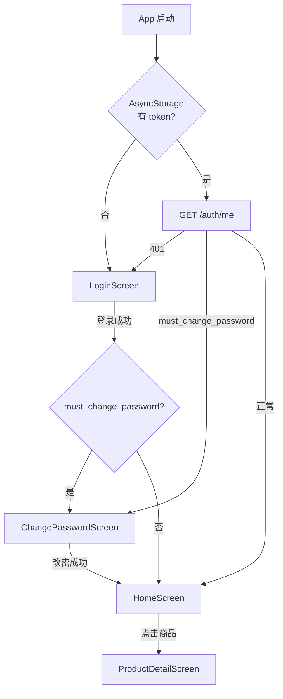

# M08 — App 登录与商品浏览 Design Spec

> **文档版本：** v1.0.0  
> **日期：** 2026-07-12  
> **依赖：** M03 认证员工（已完成）、M04 商品目录 App API（进行中，M08 联调前须完成）  
> **后续依赖方：** M09 App 下单与支付、M10 App 订单中心

---

## 1. 目标

实现 React Native 员工端 **登录 → 首次改密 → 商品浏览** 完整链路：Token 持久化、分类 Tab 筛选、商品列表与详情，对接 Backend `/api/v1/auth/*` 与 `/api/v1/categories|products`。

**非目标（M08 不做）：**
- 购物车、下单、支付（留 M09）
- 订单列表、个人中心 Tab 导航（留 M10）
- iOS 专项适配与验收（能编译即可）
- 登出 UI（API 封装预留，首页暂不暴露入口）
- UI 组件库（纯 StyleSheet）
- E2E / Detox 测试

---

## 2. 设计决策摘要

| 决策 | 选择 | 理由 |
|---|---|---|
| 实现方案 | **方案 1**：React Navigation + AuthContext + fetch | 依赖最少，与 bare RN 脚手架契合 |
| 首次改密 | **纳入 M08**，强制 ChangePasswordScreen | 与 M03 `password.changed` 中间件一致 |
| 平台 | **Android 优先** | 与总体 Spec 一致 |
| 商品列表 | **单列左图右文** | 名称、描述、价格信息清晰 |
| API 地址 | `src/config/api.ts` + 平台默认值 | 不引入 `.env` 插件 |
| 分类 Tab | **含「全部」**，默认选中 | 一屏浏览全部在售商品 |
| Token 存储 | AsyncStorage key `@king_shop/token` | RN 标准做法 |
| 价格展示 | 后端 `price` 为分，前端 `formatPrice` 转 `¥15.00` | 与 M04 一致 |

---

## 3. 架构

### 3.1 导航与鉴权流程



**RootNavigator 三态：**

| 状态 | Stack | 屏幕 |
|---|---|---|
| 无 token | AuthStack | LoginScreen |
| 有 token + `must_change_password` | ChangePasswordStack | ChangePasswordScreen |
| 有 token + 已改密 | MainStack | HomeScreen → ProductDetailScreen |

**全局错误路由：**

| 场景 | HTTP / code | App 行为 |
|---|---|---|
| Token 失效 | 401 | 清 token，回 LoginScreen |
| 需改密访问业务 API | 403 / 40301 | 跳转 ChangePasswordScreen |
| 账号禁用 | 403（登录时） | LoginScreen 展示错误 |
| 商品不可见 | 404 | ProductDetail 展示「商品不存在」 |

### 3.2 目录结构

```
app/src/
├── api/
│   ├── client.ts          # fetch 封装、Bearer、ApiError
│   ├── tokenStorage.ts    # AsyncStorage 读写 token
│   ├── auth.ts            # login / logout / me / changePassword
│   └── catalog.ts         # categories / products / getProduct
├── config/
│   └── api.ts             # API_BASE_URL
├── context/
│   └── AuthContext.tsx    # token、user、login/logout/refreshUser
├── navigation/
│   ├── RootNavigator.tsx
│   └── types.ts           # RootStackParamList 等
├── screens/
│   ├── LoginScreen.tsx
│   ├── ChangePasswordScreen.tsx
│   ├── HomeScreen.tsx
│   └── ProductDetailScreen.tsx
├── components/
│   ├── CategoryTabs.tsx
│   ├── ProductListItem.tsx
│   ├── EmptyState.tsx
│   └── LoadingView.tsx
├── utils/
│   └── formatPrice.ts
└── types/
    └── api.ts
```

`App.tsx` 仅挂载 `NavigationContainer` → `AuthProvider` → `RootNavigator`。

---

## 4. 依赖

| 包 | 用途 |
|---|---|
| `@react-navigation/native` | 导航容器 |
| `@react-navigation/native-stack` | Stack 导航 |
| `react-native-screens` | 导航性能 |
| `react-native-safe-area-context` | SafeArea |
| `@react-native-async-storage/async-storage` | Token 持久化 |

**版本约束：** React **18.3.1** · React Native **0.76.9** · TypeScript **5.0.4**（见 `.cursor/rules/versions.mdc`）

---

## 5. API 对接

### 5.1 配置

```typescript
// src/config/api.ts
import { Platform } from 'react-native';

const DEV_HOST = Platform.OS === 'android' ? '10.0.2.2' : 'localhost';

export const API_BASE_URL = `http://${DEV_HOST}:8000/api/v1`;
```

真机调试时手动改为局域网 IP（注释说明）。

**Android 开发：** `AndroidManifest.xml` 的 `<application>` 增加 `android:usesCleartextTraffic="true"`（本地 HTTP 联调）。

### 5.2 认证 API（M03，已完成）

| 方法 | 路径 | 说明 |
|---|---|---|
| POST | `/auth/login` | `{ phone, password }` → `{ token, user, must_change_password }` |
| GET | `/auth/me` | 当前用户（含 `must_change_password`） |
| PUT | `/auth/password` | `{ current_password, new_password, new_password_confirmation }` |
| POST | `/auth/logout` | 撤销 token（M08 封装，UI 暂不暴露） |

**User 字段：** `id`, `name`, `phone`, `employee_no`, `department`, `role`, `status`, `avatar`, `must_change_password`

### 5.3 商品 API（M04 App 端，联调前须完成）

| 方法 | 路径 | 说明 |
|---|---|---|
| GET | `/categories` | active 分类列表，按 sort 升序 |
| GET | `/products` | `?category_id=&page=&per_page=20`，仅可见商品 |
| GET | `/products/{id}` | 可见商品详情 |

**GET `/categories` Response：**

```json
{
  "code": 0,
  "message": "ok",
  "data": [
    { "id": 1, "name": "饮品", "sort": 1 }
  ]
}
```

**GET `/products` Response：**

```json
{
  "code": 0,
  "message": "ok",
  "data": {
    "items": [
      {
        "id": 1,
        "name": "拿铁",
        "description": "热饮",
        "price": 1500,
        "image_url": "http://10.0.2.2:8000/storage/uploads/2026/07/abc.jpg",
        "category_id": 1,
        "category_name": "饮品",
        "status": "on_sale"
      }
    ],
    "meta": { "total": 1, "page": 1, "per_page": 20 }
  }
}
```

**GET `/products/{id}` Response：** 单条 `Product` 对象（字段同上，无 `category_name` 亦可）。

### 5.4 API Client 约定

- 统一解析 `{ code, message, data }`；`code !== 0` 抛 `ApiError(code, message)`
- 请求头：`Content-Type: application/json`；有 token 时 `Authorization: Bearer <token>`
- `client.ts` 导出 `setTokenGetter(() => string | null)` 供 AuthContext 注入，避免循环依赖

---

## 6. 页面设计

### 6.1 LoginScreen

- 输入：手机号（11 位）、密码
- 按钮：登录（loading 态禁用重复提交）
- 错误：401「手机号或密码错误」、403「账号已禁用」、网络错误通用提示

### 6.2 ChangePasswordScreen

- 输入：当前密码、新密码、确认新密码
- 规则：新密码最少 6 位（与 M03 一致）
- 成功后：`refreshUser()` → `must_change_password=false` → 进入 HomeScreen
- **不可跳过**（无「稍后」按钮）

### 6.3 HomeScreen

- **CategoryTabs：** 横向 ScrollView，首项「全部」（`categoryId = null`），其余来自 API；选中态高亮
- **商品列表：** `FlatList` 单列
  - 左：`Image` 80×80，`image_url` 为空时灰色占位
  - 右：名称（1 行）、描述（最多 2 行 `numberOfLines={2}`）、价格（`formatPrice`）
- **下拉刷新：** `RefreshControl` 重置 page=1
- **分页：** 触底 `onEndReached` 加载下一页，`meta.total` 判断已无更多
- **空状态：** 「暂无商品」
- **点击行：** `navigation.navigate('ProductDetail', { productId })`

### 6.4 ProductDetailScreen

- 大图（宽 100%，aspectRatio 1:1 或固定高度）
- 名称、描述、价格
- 顶部返回
- **不含**购买按钮（M09）
- 404：展示「商品不存在或已下架」

---

## 7. 测试计划

| 类型 | 目录 | 覆盖 |
|---|---|---|
| Jest Unit | `app/__tests__/utils/` | `formatPrice` |
| Jest Unit | `app/__tests__/api/` | `client` 响应解析、`ApiError`、40301/401 识别 |
| Jest Unit | `app/__tests__/api/` | `tokenStorage` 读写（mock AsyncStorage） |
| 手工验收 | Android 模拟器 | 完整登录改密浏览链路 |

**完成门槛：**

```bash
cd app && npm test
```

手工：Docker Backend 启动 + Android 模拟器联调通过验收标准。

---

## 8. 验收标准

- [ ] 员工手机号 + 密码可登录
- [ ] `must_change_password=true` 时强制改密后才能浏览
- [ ] 「全部」Tab 展示所有在售商品；切换分类正确筛选
- [ ] 商品图片正常加载（含无图占位）
- [ ] 下拉刷新、分页加载、空状态正常
- [ ] 商品详情页展示完整信息
- [ ] `npm test` 通过
- [ ] Android 模拟器可联调 Docker Backend（`10.0.2.2:8000`）

---

## 9. 前置依赖与并行策略

| 模块 | 状态 | M08 关系 |
|---|---|---|
| M03 Auth API | ✅ 完成 | 直接对接 |
| M04 App Catalog API | 🔄 进行中 | **联调阻塞项**；M08 可先写 UI + mock，验收前须 M04 Task 7 完成 |

建议：M08 与 M04 并行开发；M04 App API 合并后再做端到端验收。

---

## 10. 对总体 Spec 的补充说明

| 总体 Spec | M08 补充 | 原因 |
|---|---|---|
| M08 仅列 Login/Home/Detail | **增加 ChangePasswordScreen** | M03 首次改密中间件强制要求 |
| iOS + Android | **Android 优先验收** | 总体 Spec 先 Android |
| 未指定列表布局 | **单列左图右文** | 用户确认 |
| 未指定「全部」分类 | **默认「全部」Tab** | 用户确认 |
