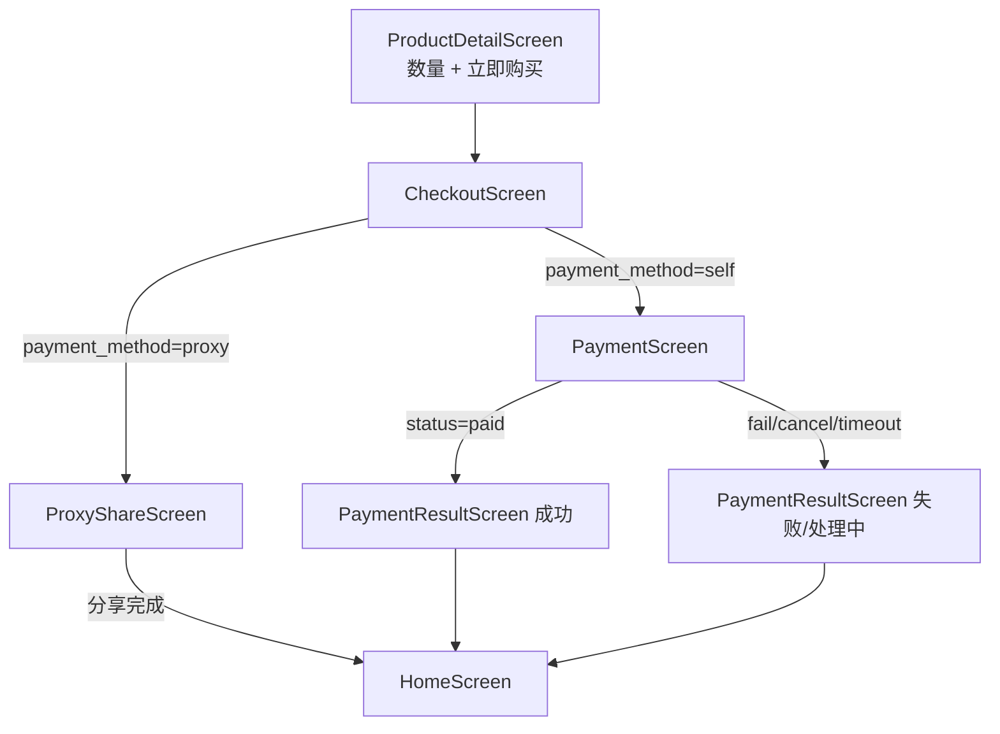

# M09 — App 下单与支付 Design Spec

> **文档版本：** v1.0.0  
> **日期：** 2026-07-12  
> **依赖：** M05 订单（已完成）、M06 支付对接（已完成）、M07 找人代付（已完成）、M08 App 登录与商品浏览（已完成）  
> **后续依赖方：** M10 App 订单中心

---

## 1. 目标

实现 React Native 员工端 **详情页直接购买 → 确认订单 → 自付/代付 → 支付调起** 完整链路，对接 Backend 订单与支付 API，支持 **fake（开发）、支付宝沙箱 WebView、微信 APP SDK** 三通道。

**非目标（M09 不做）：**
- 购物车、多商品合并结算
- 订单列表、订单详情、取消订单（留 M10）
- Tab 导航 / 个人中心（留 M10）
- 代付 H5 落地页改动（M07 已有 frontend 公开路由）
- iOS 专项适配与验收（能编译即可）
- UI 组件库（纯 StyleSheet，延续 M08）
- E2E / Detox 测试
- 后端 API 或领域逻辑变更

---

## 2. 设计决策摘要

| 决策 | 选择 | 理由 |
|---|---|---|
| 购物流程 | **详情页直接购买** | 内部商城单件为主，最快验收支付链路 |
| 导航方案 | **方案 1**：MainStack 线性扩展 | 与 M08 一致，改动集中 |
| 支付集成 | **fake + 支付宝 WebView + 微信 APP SDK** | 三通道全接，开发/演示/生产均可验收 |
| 付款方式 | **确认页展示自己付 / 找人代付** | 与 M07 代付链路对齐，一次选清 |
| 支付渠道 | **确认页预选 channel**（仅自付） | PaymentScreen 专注调起与轮询 |
| 支付确认 | **轮询 `GET /orders/{id}`** | 后端已有 `payments:query-pending` 补偿，App 轮询即可 |
| 微信 SDK | **`react-native-wechat-lib`** | RN 社区常用，支持 APP 支付 |
| 支付宝 | **`react-native-webview`** 打开 `pay_url` | 与 M06 `AlipaySandboxGateway` WAP 形态一致 |
| fake 联调 | **`__DEV__` 模拟支付按钮** → POST notify | 与 `PaymentApiTest` 全链路一致 |

---

## 3. 架构

### 3.1 导航与下单流程



**MainStack 扩展：**

| 屏幕 | 路由参数 | 说明 |
|---|---|---|
| Home | — | 已有 |
| ProductDetail | `{ productId }` | 已有，新增数量与购买入口 |
| Checkout | `{ productId, quantity }` | 确认订单 |
| Payment | `{ orderId, channel }` | 自付调起 |
| ProxyShare | `{ orderId }` | 代付链接与分享 |
| PaymentResult | `{ orderId, outcome }` | `success` / `failed` / `pending` |

### 3.2 自付时序

```
1. ProductDetail：选 quantity，点「立即购买」
2. Checkout：展示商品摘要；选 payment_method=self；选 channel；可选 remark
3. POST /api/v1/orders { items, payment_method, remark }
4. navigate PaymentScreen(orderId, channel)
5. POST /api/v1/orders/{id}/pay { channel }
6. 按 pay_params.channel 调起：
   - fake → 模拟支付按钮 → POST /payments/notify/alipay（dev）
   - alipay_sandbox → WebView 打开 pay_url
   - wechat → WeChat SDK pay(prepay)
7. 轮询 GET /api/v1/orders/{id}，每 2s，最多 30 次
8. paid → PaymentResult success；超时 → pending；SDK 取消 → failed
```

### 3.3 代付时序

```
1. Checkout：payment_method=proxy（不展示 channel）
2. POST /api/v1/orders { items, payment_method: proxy, remark }
3. POST /api/v1/orders/{id}/proxy-pay-link
4. navigate ProxyShareScreen
5. Share.share({ message: url, title: '帮我付一下' })
6. 展示链接、expires_at；用户返回 Home
7. 同事打开 H5（M07）完成 JSAPI / fake 支付
```

### 3.4 目录结构

```
app/src/
├── api/
│   ├── client.ts              # 已有
│   ├── catalog.ts             # 已有
│   └── orders.ts              # 新增：createOrder, getOrder, payOrder, proxyPayLink
├── config/
│   └── api.ts                 # 已有；可选 NOTIFY_BASE_URL 供 fake notify
├── navigation/
│   ├── RootNavigator.tsx      # 注册新 Screen
│   └── types.ts               # 扩展 MainStackParamList
├── screens/
│   ├── ProductDetailScreen.tsx  # 改：数量 Stepper + 立即购买
│   ├── CheckoutScreen.tsx       # 新
│   ├── PaymentScreen.tsx        # 新
│   ├── ProxyShareScreen.tsx     # 新
│   └── PaymentResultScreen.tsx  # 新
├── components/
│   ├── QuantityStepper.tsx      # 新
│   └── PaymentChannelPicker.tsx # 新（自付 channel 单选）
├── services/
│   └── paymentLauncher.ts       # 新：按 channel 调起 + fake notify
├── types/
│   ├── api.ts                   # 已有
│   └── order.ts                 # 新：Order, PayParams 等
└── utils/
    ├── formatPrice.ts           # 已有
    └── pollOrderStatus.ts       # 新：轮询直到 paid 或超时
```

### 3.5 新增依赖

| 包 | 版本策略 | 用途 |
|---|---|---|
| `react-native-webview` | 与 RN 0.76 兼容的最新 13.x | 支付宝 WAP |
| `react-native-wechat-lib` | 与 RN 0.76 兼容 | 微信 APP 支付 |

**Android 原生配置（实施计划详述）：**
- `android/app/build.gradle` 微信 AppID
- `AndroidManifest.xml` 微信回调 Activity
- 微信开放平台 App 应用签名与包名登记

---

## 4. API 契约

### 4.1 创建订单

`POST /api/v1/orders`

```json
{
  "items": [{ "product_id": 1, "quantity": 2 }],
  "payment_method": "self",
  "remark": "少糖"
}
```

| 字段 | 规则 |
|---|---|
| `payment_method` | `self`（默认）或 `proxy` |
| `items.*.quantity` | 1–99 |

响应 `201`：`OrderResource`（含 `id`, `order_no`, `total_amount`, `status: pending_payment`）。

### 4.2 发起支付（自付）

`POST /api/v1/orders/{id}/pay`

```json
{ "channel": "alipay_sandbox" }
```

| channel | pay_params 形态 |
|---|---|
| `fake` | `{ channel, trade_type, out_trade_no, amount, order_no }` |
| `alipay_sandbox` | `{ channel, pay_url }` |
| `wechat` | `{ channel, prepay: { appid, partnerid, prepayid, package, noncestr, timestamp, sign } }` |

### 4.3 代付链接

`POST /api/v1/orders/{id}/proxy-pay-link`

响应：

```json
{
  "url": "https://frontend.example/proxy-pay/{token}",
  "token": "...",
  "expires_at": "2026-07-12T15:30:00+08:00"
}
```

### 4.4 查询订单（轮询）

`GET /api/v1/orders/{id}` — 当 `status === 'paid'` 时停止轮询。

### 4.5 fake 模拟支付（仅开发）

`POST /api/v1/payments/notify/alipay`（无 Bearer，公开端点）

```json
{
  "trade_status": "TRADE_SUCCESS",
  "out_trade_no": "<来自 pay_params>",
  "trade_no": "FAKE_DEV_001"
}
```

仅在 `local` / `testing` 环境有效（`PaymentChannelPolicy::fakeAllowed()`）。

---

## 5. 屏幕规格

### 5.1 ProductDetailScreen（改）

- 底部固定栏：左侧 `QuantityStepper`（1–99），右侧「立即购买」按钮
- 库存/下架商品：按钮 disabled（若 API 无 stock 字段，仅依赖下单时后端校验）
- 导航：`navigation.navigate('Checkout', { productId, quantity })`

### 5.2 CheckoutScreen

**展示：**
- 商品图、名称、单价 × 数量、合计金额
- 备注 `TextInput`（multiline，max 500）
- 付款方式单选：`自己付` / `找人代付`
- 支付渠道单选（仅 `自己付`）：`支付宝` / `微信`；`__DEV__` 额外 `模拟支付`

**提交：**
- Loading 态防重复提交
- 成功 → 按 `payment_method` 分支导航 Payment / ProxyShare
- 失败 → 展示 API message（库存不足、商品下架等）

### 5.3 PaymentScreen

**展示：** 订单号、应付金额、所选渠道名称

**行为：**
1. mount 时调用 `payOrder(orderId, channel)`
2. 调用 `paymentLauncher.launch(pay_params)`
3. 支付返回后开始 `pollOrderStatus(orderId)`
4. 根据结果 navigate `PaymentResult`

**错误：**
| 场景 | 提示 |
|---|---|
| 42204 | 「订单无法支付」 |
| 微信用户取消 | 「支付已取消」 |
| WebView 加载失败 | 「无法打开支付页面，请重试」 |
| 网络错误 | 「网络异常，请重试」 |

### 5.4 ProxyShareScreen

- mount 时调用 `proxyPayLink(orderId)`
- 展示：订单号、金额、代付链接、过期时间
- 按钮：「分享给同事」（`Share.share`）、「复制链接」（`Clipboard`）
- 「返回首页」→ `navigation.popToTop()` 或 navigate Home

### 5.5 PaymentResultScreen

| outcome | 展示 |
|---|---|
| `success` | ✅ 支付成功；订单号；「返回首页」 |
| `failed` | ❌ 支付失败/已取消；「返回首页」 |
| `pending` | ⏳ 支付处理中，请稍后在订单中心查看；「返回首页」 |

> 「查看订单」入口留 M10。

---

## 6. 支付调起实现

### 6.1 `paymentLauncher.ts`

```typescript
type PayParams =
  | { channel: 'fake'; out_trade_no: string; /* ... */ }
  | { channel: 'alipay_sandbox'; pay_url: string }
  | { channel: 'wechat'; prepay: WechatPrepayParams };

async function launchPay(params: PayParams): Promise<'success' | 'cancelled' | 'failed'>;
```

| channel | 实现 |
|---|---|
| `fake` | Alert +「模拟支付成功」→ `simulateFakeNotify(out_trade_no)` |
| `alipay_sandbox` | 全屏 Modal WebView 加载 `pay_url`；用户关闭后开始轮询 |
| `wechat` | `WeChat.pay(prepay)`；errCode 0 成功，-2 取消 |

### 6.2 轮询

```typescript
async function pollOrderStatus(
  orderId: number,
  options?: { intervalMs?: number; maxAttempts?: number },
): Promise<'paid' | 'timeout'>;
```

默认：`intervalMs=2000`，`maxAttempts=30`。

---

## 7. 错误处理

| 场景 | HTTP / code | App 行为 |
|---|---|---|
| Token 失效 | 401 | 清 token，回 Login（沿用 M08 client） |
| 需改密 | 40301 | refreshUser → ChangePassword |
| 订单不存在 | 404 | 提示并返回 |
| 非本人订单 | 403 | 提示并返回 |
| 代付订单走自付 API | 42204 | Checkout 已分支，不应触发 |
| 非待支付 | 42204 | Payment 提示并 pop |

---

## 8. 测试策略

M09 为 App 端，**不强制 Jest 集成测试**；验收以手动 + fake 通道为主。

| 场景 | 验收方式 |
|---|---|
| 自付 fake 全链路 | Android 模拟器 / 真机，`channel=fake` |
| 自付支付宝 | 配置 M01 沙箱凭证，WebView 完成沙箱支付 |
| 自付微信 | 配置微信 App 商户号，SDK 调起（可 staging 环境） |
| 代付分享 | 下单 proxy → Share 面板弹出 → 链接在浏览器可打开 M07 H5 |
| 支付取消 | 微信 SDK 返回取消 → failed 结果页 |
| 后端回归 | `./scripts/docker-test.sh --filter=OrderApiTest` 与 `PaymentApiTest` 保持全绿（无 backend 改动预期） |

---

## 9. 验收标准

- [ ] 商品详情可选数量（1–99）并进入确认订单
- [ ] 确认页可选「自己付 / 找人代付」；自付可选支付渠道
- [ ] 自付 fake：选品 → 下单 → 模拟支付 → 订单 `paid`
- [ ] 自付支付宝：WebView 打开沙箱 → 支付后订单 `paid`
- [ ] 自付微信：SDK 调起 → 支付后订单 `paid`
- [ ] 代付：下单 → 生成链接 → 系统分享可用
- [ ] 支付取消/失败/超时均有明确结果页提示
- [ ] 不引入 React 非 18.3、RN 非 0.76.9 版本

---

## 10. 预估

**2.5 天**

| 阶段 | 内容 | 时间 |
|---|---|---|
| API + 类型 + 导航骨架 | orders.ts、types、Stack 注册 | 0.5 天 |
| Checkout + Detail 改造 | 数量、确认页、下单 | 0.5 天 |
| Payment + fake + 轮询 | PaymentScreen、paymentLauncher | 0.5 天 |
| 支付宝 WebView + 微信 SDK | 依赖安装、Android 原生配置 | 1 天 |
| 代付分享 + 结果页 + 联调 | ProxyShare、PaymentResult | 0.5 天 |

---

## 11. Follow-up（不在 M09）

| 项 | 模块 |
|---|---|
| 订单列表/详情/取消 | M10 |
| 支付结果页「查看订单」 | M10 |
| 微信/支付宝生产配置与签名 | M14 / M16 |
| 购物车 | 按需后续迭代 |
