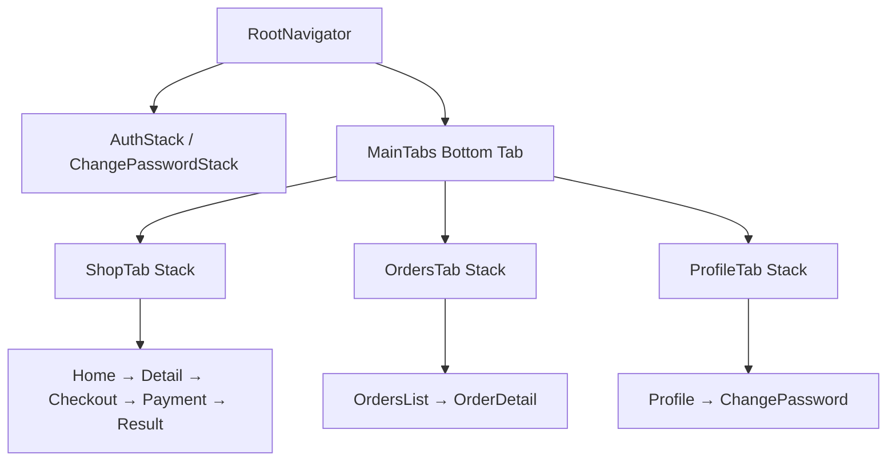

# M10 — App 订单管理与个人中心 Design Spec

> **文档版本：** v1.0.0  
> **日期：** 2026-07-12  
> **依赖：** M05 订单（已完成）、M08 App 登录与商品浏览（已完成）、M09 App 下单与支付（已完成）  
> **后续依赖方：** M07 代付分享完善（可选）、M14 生产配置

---

## 1. 目标

实现 React Native 员工端 **底部 Tab 导航**、**订单列表/详情/操作**、**个人中心**，补齐 M09 遗留的「查看订单」入口，对接 Backend 员工订单 API。

**非目标（M10 不做）：**
- 购物车、重新下单
- 订单搜索、推送通知
- iOS 专项适配与验收（能编译即可）
- UI 组件库（纯 StyleSheet，延续 M08/M09）
- E2E / Detox 测试
- 管理端订单操作 UI

---

## 2. 设计决策摘要

| 决策 | 选择 | 理由 |
|---|---|---|
| 导航方案 | **Bottom Tab + 嵌套 Stack** | 符合验收「Tab 导航」；商品/订单/我的互不干扰 |
| 订单筛选 | **横向状态 Tab** | 用户确认；后端已支持 `?status=` |
| 进行中 Tab | **并行请求 `paid` + `preparing` 合并** | 不扩后端 API；员工订单量低可接受 |
| 待支付操作 | **去支付 + 重选渠道** | 用户确认；复用 PaymentChannelPicker |
| 确认取餐 | **新增员工 `POST /orders/{id}/complete`** | 总体 Spec 要求员工确认取餐；admin API 已有 |
| 个人中心 | **姓名/部门/手机号 + 改密 + 退出** | 用户确认；复用 AuthContext |
| 支付结果页 | **增加「查看订单」跳转** | M09 Follow-up |

---

## 3. 架构

### 3.1 导航结构



**Tab 标签：** 商品 | 订单 | 我的

| Stack | 屏幕 | 路由参数 |
|---|---|---|
| ShopTab | Home, ProductDetail, Checkout, Payment, ProxyShare, PaymentResult | 同 M09 MainStack |
| OrdersTab | OrdersList, OrderDetail | `OrderDetail: { orderId: number }` |
| ProfileTab | Profile, ChangePassword | — |

**跨 Tab 跳转：**

- PaymentResult「查看订单」→ `OrdersTab > OrderDetail({ orderId })`
- OrderDetail「去支付」→ `ShopTab > Payment({ orderId, channel })`（支付栈留在商品 Tab）
- Profile「修改密码」→ ProfileTab 内 ChangePasswordScreen（非强制改密栈）

### 3.2 订单列表状态 Tab

| Tab | API |
|---|---|
| 全部 | `GET /orders` |
| 待支付 | `GET /orders?status=pending_payment` |
| 进行中 | 并行 `status=paid` + `status=preparing`，按 `created_at` 降序合并 |
| 可取餐 | `GET /orders?status=ready` |
| 已完成 | `GET /orders?status=completed` |

已取消订单仅在「全部」展示，无独立 Tab。

### 3.3 订单详情操作

| 状态 | 操作 |
|---|---|
| `pending_payment` | 去支付（选渠道 → ShopTab Payment）、取消订单 |
| `ready` | 确认取餐 |
| 其他 | 只读 |

### 3.4 目录结构

```
app/src/
├── api/
│   └── orders.ts              # 扩展 listOrders, cancelOrder, completeOrder
├── navigation/
│   ├── RootNavigator.tsx      # MainTabs + 三 Stack
│   └── types.ts               # Shop/Orders/Profile Stack 类型
├── screens/
│   ├── OrdersScreen.tsx       # 新
│   ├── OrderDetailScreen.tsx  # 新
│   ├── ProfileScreen.tsx      # 新
│   └── PaymentResultScreen.tsx # 改：查看订单
├── components/
│   ├── OrderListItem.tsx      # 新
│   └── OrderStatusTabs.tsx    # 新（横向状态 Tab）
├── utils/
│   ├── orderStatus.ts         # 新：状态标签/颜色
│   └── payChannels.ts         # 新：selfPayChannels 从 Checkout 抽出
backend/app/
├── Application/Order/CompleteMyOrder/CompleteMyOrderHandler.php
└── Http/Controllers/Catalog/OrderController.php  # complete 方法
```

---

## 4. 后端补充

### 4.1 新增端点

```
POST /api/v1/orders/{id}/complete
```

- Handler：`CompleteMyOrderHandler`
- 校验：订单归属当前用户
- 状态：`ready` → `completed`（复用 `CompleteOrderHandler`）
- 错误：非 ready → 42201；非本人 → 403；不存在 → 404

### 4.2 测试

`tests/Feature/Catalog/OrderApiTest.php` 新增：

- 员工可取餐订单可确认完成
- 非 ready 状态不可确认
- 不可操作他人订单

---

## 5. App API 扩展

```typescript
// listOrders
interface ListOrdersParams {
  status?: OrderStatus;
  page?: number;
  per_page?: number;
}
interface PaginatedOrders {
  items: Order[];
  meta: { total: number; page: number; per_page: number };
}

listOrders(params?: ListOrdersParams): Promise<PaginatedOrders>
cancelOrder(orderId: number): Promise<Order>
completeOrder(orderId: number): Promise<Order>
```

---

## 6. 屏幕规格

### 6.1 OrdersScreen

- 顶部 `OrderStatusTabs` 横向滚动
- `FlatList` + 下拉刷新 + 触底加载
- 列表项 `OrderListItem`：订单号、首件商品名、金额、状态标签、时间
- 空态 `EmptyState`

### 6.2 OrderDetailScreen

- 状态徽章、商品明细列表、合计、备注、支付方式
- 代付订单展示 `paid_by_user.name`
- 底部操作区按状态显隐
- 「去支付」：Modal 内 `PaymentChannelPicker` → 跨 Tab 导航 Payment
- 「取消」「确认取餐」：`Alert.alert` 二次确认

### 6.3 ProfileScreen

- 头像占位（姓名首字圆形）
- 姓名、部门、手机号、工号（有则显示）
- 「修改密码」「退出登录」按钮
- 退出前 `Alert` 确认

### 6.4 PaymentResultScreen（改动）

- 成功/处理中：「查看订单」+「返回首页」
- 失败：仅「返回首页」（保持现状）

---

## 7. 测试策略

| 层 | 内容 | 命令 |
|---|---|---|
| Backend Feature | complete API 三用例 | `./scripts/docker-test.sh --filter=OrderApiTest` |
| App Jest | orders API、orderStatus util | `cd app && npm run test:m10` |
| 手工 | Tab 切换、筛选、操作 | Android 模拟器 |

---

## 8. 验收标准

- [ ] 底部 Tab：商品 / 订单 / 我的可切换
- [ ] 订单列表 5 个状态 Tab 筛选正确
- [ ] 待支付可取消、可去支付（重选渠道）
- [ ] 可取餐可确认完成
- [ ] 个人中心展示姓名、部门、手机号，可改密、可退出
- [ ] 支付结果页可跳转订单详情
- [ ] 不引入 React 非 18.3、RN 非 0.76.9 版本

---

## 9. 预估

**1 天**

| 阶段 | 内容 | 时间 |
|---|---|---|
| 后端 complete API + 测试 | CompleteMyOrderHandler | 0.25 天 |
| 导航重构 + Tab | bottom-tabs、三 Stack | 0.25 天 |
| 订单列表/详情 | OrdersScreen、OrderDetailScreen | 0.25 天 |
| 个人中心 + 衔接 | ProfileScreen、PaymentResult | 0.25 天 |

---

## 10. Follow-up（不在 M10）

| 项 | 模块 |
|---|---|
| 订单角标（待支付数量） | 按需迭代 |
| 代付订单分享入口（从详情） | M07 增强 |
| 强制改密与个人中心改密 UI 合并优化 | 按需 |
