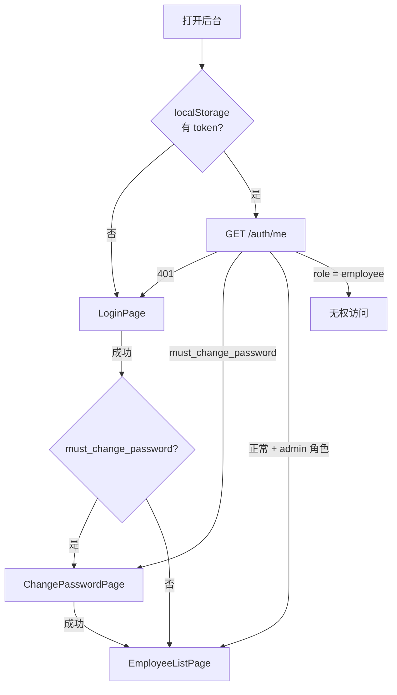

# M11 — 管理后台：员工管理 Design Spec

> **文档版本：** v1.0.0  
> **日期：** 2026-07-12  
> **依赖：** M03 用户认证与员工模型（已完成）  
> **后续依赖方：** M12 后台商品、M13 后台订单、M14 后台配置

---

## 1. 目标

实现 React 管理后台 **登录 → 首次改密 → 员工 CRUD** 完整链路：Token 持久化、分页搜索列表、Modal 新增/编辑、软删除禁用，对接 Backend `/api/v1/auth/*` 与 `/api/v1/admin/employees`。

**交付物：**
- 管理员登录页、首次改密页
- 可扩展 Admin Layout（顶栏 + 侧边栏，M11 仅「员工管理」菜单）
- `frontend/src/pages/employees/` 员工列表页
- API 层（`src/api/`）与 AuthContext

**非目标（M11 不做）：**
- 商品/订单/配置页面（留 M12–M14）
- 侧边栏预置未实现模块菜单
- 前端自动化测试（Vitest / Playwright）
- 员工自助改密（非首次场景）
- 头像上传
- 深色模式 / 国际化

---

## 2. 设计决策摘要

| 决策 | 选择 | 理由 |
|---|---|---|
| 实现方案 | **方案 1**：Ant Design 5 + React Router + fetch + Context | 依赖最少，与 M08 App 数据层模式一致 |
| UI 库 | **Ant Design 5** | 表格/表单/分页开箱即用，适合 CRUD 密集后台 |
| CRUD 交互 | **表格 + Modal** | 员工字段少，列表内完成操作最高效 |
| 侧边栏 | **仅「员工管理」** | YAGNI；Layout 组件可扩展，M12 再加菜单 |
| 测试 | **手工验收清单** | M11 是第一个 frontend 模块，优先打通主链路 |
| Token 存储 | `localStorage` key `king_shop_token` | Web 标准做法 |
| API 基址 | `VITE_API_BASE_URL`（`.env.example` 已有） | 与项目约定一致 |
| 首次改密 | **纳入 M11**，强制 ChangePasswordPage | 与 M03 `EnsurePasswordChanged` 中间件一致 |

---

## 3. 架构

### 3.1 路由与鉴权流程



**路由表：**

| 路径 | 组件 | 鉴权 |
|------|------|------|
| `/login` | LoginPage | 公开 |
| `/change-password` | ChangePasswordPage | 需 token |
| `/employees` | EmployeeListPage | 需 token + 已改密 + admin |
| `/` | redirect → `/employees` | — |
| `*` | redirect → `/employees` 或 `/login` | — |

**路由守卫（`ProtectedRoute` / `AdminRoute`）：**

| 条件 | 行为 |
|------|------|
| 无 token | 跳转 `/login` |
| 有 token + `must_change_password` | 仅允许 `/change-password`；访问其他路由跳转改密页 |
| 有 token + `role === 'employee'` | 展示「无权访问管理后台」，提供登出按钮 |
| API 401 | 清 token，跳转 `/login` |
| API 403 / code `40301` | 跳转 `/change-password` |

### 3.2 目录结构

```
frontend/src/
├── api/
│   ├── client.ts              # fetch 封装、Bearer、ApiError、响应解析
│   ├── auth.ts                # login / logout / me / changePassword
│   └── employees.ts           # list / create / get / update / disable
├── contexts/
│   └── AuthContext.tsx        # user、token、login / logout / refreshUser
├── components/
│   ├── AdminLayout.tsx        # Layout + Sider + Header + Outlet + 登出
│   ├── ProtectedRoute.tsx     # 鉴权守卫
│   └── EmployeeFormModal.tsx  # 新增/编辑 Modal
├── pages/
│   ├── LoginPage.tsx
│   ├── ChangePasswordPage.tsx
│   └── employees/
│       └── EmployeeListPage.tsx
├── types/
│   ├── api.ts                 # ApiResponse<T>、PaginatedMeta
│   └── employee.ts            # Employee、Role、Status
├── App.tsx                    # Router + AuthProvider + ConfigProvider(zhCN)
└── main.tsx
```

### 3.3 新增依赖

```json
{
  "antd": "^5.22.0",
  "react-router-dom": "^6.28.0",
  "@ant-design/icons": "^5.5.0"
}
```

---

## 4. API 对接

### 4.1 认证（M03 已有）

| 前端方法 | 后端 | 说明 |
|----------|------|------|
| `authApi.login(phone, password)` | POST `/auth/login` | 返回 token + user |
| `authApi.me()` | GET `/auth/me` | 刷新当前用户 |
| `authApi.changePassword(...)` | PUT `/auth/password` | 首次/主动改密 |
| `authApi.logout()` | POST `/auth/logout` | 撤销 token |

**登录响应：**
```json
{
  "code": 0,
  "data": {
    "token": "1|xxx",
    "user": { "id": 1, "name": "...", "role": "admin", "must_change_password": false, ... },
    "must_change_password": false
  }
}
```

### 4.2 员工管理（M03 已有）

| 前端方法 | 后端 | 说明 |
|----------|------|------|
| `employeesApi.list(params)` | GET `/admin/employees` | keyword + page + per_page |
| `employeesApi.create(data)` | POST `/admin/employees` | 默认密码 123456 |
| `employeesApi.get(id)` | GET `/admin/employees/{id}` | 编辑前拉详情（可选，列表数据亦可） |
| `employeesApi.update(id, data)` | PUT `/admin/employees/{id}` | 含 reset_password |
| `employeesApi.disable(id)` | DELETE `/admin/employees/{id}` | 软删除 status=disabled |

**列表响应：**
```json
{
  "code": 0,
  "data": {
    "items": [ { /* Employee */ } ],
    "meta": { "total": 50, "page": 1, "per_page": 20 }
  }
}
```

### 4.3 TypeScript 类型

```typescript
type Role = 'employee' | 'admin' | 'super_admin';
type Status = 'active' | 'disabled';

interface Employee {
  id: number;
  name: string;
  phone: string;
  employee_no: string | null;
  department: string | null;
  role: Role;
  status: Status;
  avatar: string | null;
  must_change_password: boolean;
}

interface PaginatedMeta {
  total: number;
  page: number;
  per_page: number;
}
```

与 `EmployeeResource` / `AuthUserResource` 字段对齐。

### 4.4 API Client 约定

```typescript
// 统一响应
interface ApiResponse<T> {
  code: number;
  message: string;
  data: T;
}

class ApiError extends Error {
  constructor(
    public status: number,
    public code: number,
    message: string,
    public errors?: Record<string, string[]>,
  ) { ... }
}
```

- 请求头：`Authorization: Bearer {token}`（有 token 时）
- `Content-Type: application/json`
- `code !== 0` 抛 `ApiError`
- 401 → AuthContext 清 token 并跳登录

---

## 5. 页面设计

### 5.1 LoginPage

- Ant Design `Form`：手机号 + 密码
- 提交调用 `authApi.login` → `AuthContext.login(token, user)`
- 错误：401 显示「手机号或密码错误」；403 显示「账号已禁用」
- 登录成功按 `must_change_password` 路由到改密页或员工列表
- 居中 Card 布局，标题「King Shop 管理后台」

### 5.2 ChangePasswordPage

- 字段：当前密码、新密码、确认新密码
- 校验：新密码 ≥ 6 位；两次一致
- 提交 `PUT /auth/password` → `refreshUser()` → 跳转 `/employees`
- 无侧边栏，独立全屏 Card

### 5.3 AdminLayout

- `Layout` + `Sider`（可折叠）+ `Header` + `Content`
- Sider 菜单：**仅**「员工管理」→ `/employees`
- Header 右侧：当前用户名 + 角色 Tag + 登出按钮
- `Content` 渲染 `<Outlet />`

### 5.4 EmployeeListPage

**顶部工具栏：**
- `Input.Search`：keyword 搜索，防抖 300ms，触发重新请求
- 「新增员工」按钮 → 打开空 Modal

**表格列：**

| 列 | 字段 | 渲染 |
|----|------|------|
| 姓名 | name | 文本 |
| 手机号 | phone | 文本 |
| 工号 | employee_no | 文本，空显示 `-` |
| 部门 | department | 文本，空显示 `-` |
| 角色 | role | Tag：employee 蓝 / admin 橙 / super_admin 红 |
| 状态 | status | Tag：active 绿 / disabled 灰 |
| 操作 | — | 编辑 / 重置密码 / 禁用或启用 |

**分页：** `Table` `pagination` 绑定 `page`、`per_page`、`total`（来自 `meta`）

**操作行为：**

| 操作 | 实现 |
|------|------|
| 编辑 | 打开 Modal，PUT 更新 |
| 重置密码 | `Popconfirm`「确认重置为默认密码 123456？」→ PUT `reset_password: true` |
| 禁用 | `Popconfirm` → DELETE |
| 启用 | 编辑 Modal 将 status 改为 active |

### 5.5 EmployeeFormModal

**新增模式字段：**

| 字段 | 必填 | 说明 |
|------|------|------|
| name | ✅ | 姓名 |
| phone | ✅ | 11 位手机号 |
| employee_no | — | 工号 |
| department | — | 部门 |
| role | — | 默认 employee |

**编辑模式额外：**

| 字段 | 说明 |
|------|------|
| status | active / disabled 下拉 |
| reset_password | Switch，开启后 PUT 时传 `reset_password: true` |

**权限 UI（与后端矩阵一致）：**

| 操作者 | 角色下拉选项 | 限制 |
|--------|-------------|------|
| admin | 仅 employee | 不可创建/分配 admin、super_admin |
| super_admin | employee / admin / super_admin | 无限制 |
| 编辑自己 | — | 不可改 role 为更低权限导致自我封禁；不可禁用自己 |

**提交反馈：**
- 创建成功：`message.success('创建成功，默认密码为 123456')`
- 更新成功：`message.success('保存成功')`
- 422：字段级错误映射到 Form `setFields`

---

## 6. 权限矩阵（前端展示层）

| 操作 | employee | admin | super_admin |
|------|----------|-------|-------------|
| 登录后台 | ❌ 无权页面 | ✅ | ✅ |
| 查看员工列表 | ❌ | ✅ | ✅ |
| 新增/编辑普通员工 | ❌ | ✅ | ✅ |
| 分配 admin/super_admin | ❌ | ❌（下拉隐藏） | ✅ |
| 禁用他人 | ❌ | ✅ | ✅ |
| 禁用自己 | ❌ | ❌（按钮隐藏） | ❌ |

---

## 7. 错误处理

| 场景 | HTTP / code | UI 行为 |
|------|-------------|---------|
| 登录凭证错误 | 401 | 表单下方 Alert |
| 账号禁用 | 403 | 「账号已禁用」 |
| 需改密访问 admin API | 403 / 40301 | 跳转 ChangePasswordPage |
| 无权操作 | 403 | `message.error('无权操作')` |
| 校验失败 | 422 | Modal 字段错误 / `message.error` |
| 员工不存在 | 404 | `message.error('员工不存在')` |
| 网络异常 | — | `message.error('网络异常，请重试')` |

---

## 8. 开发环境

```bash
# 后端（Docker）
./scripts/dev-up.sh

# 前端
cd frontend
cp .env.example .env   # VITE_API_BASE_URL=http://localhost:8000/api/v1
npm install
npm run dev            # 默认 http://localhost:5173
```

**测试账号（SuperAdminSeeder）：**
- 手机号：`13800000000`
- 密码：`admin123`
- 角色：`super_admin`，`must_change_password=false`

---

## 9. 验收标准

- [ ] 超管可登录并进入员工列表
- [ ] `must_change_password=true` 账号登录后强制改密，改密前无法访问 `/employees`
- [ ] `employee` 角色登录显示无权访问，可登出
- [ ] 列表分页正常，`keyword` 可搜姓名/手机号/工号
- [ ] 新增员工成功，提示默认密码 `123456`
- [ ] 编辑员工信息、重置密码成功
- [ ] 禁用员工后该账号无法登录（App 或后台）
- [ ] admin 不可分配 admin/super_admin 角色
- [ ] super_admin 可分配 admin 角色
- [ ] 不可禁用自己
- [ ] 登出清除 token，刷新后需重新登录
- [ ] `npm run build` 无 TypeScript 错误

---

## 10. 预估

**1 天**（与总体 Spec 一致）

| 任务 | 预估 |
|------|------|
| 依赖安装 + API client + AuthContext | 2h |
| 登录 + 改密页 | 1.5h |
| AdminLayout + 路由守卫 | 1h |
| 员工列表 + Modal CRUD | 3h |
| 联调 + 手工验收 | 0.5h |
