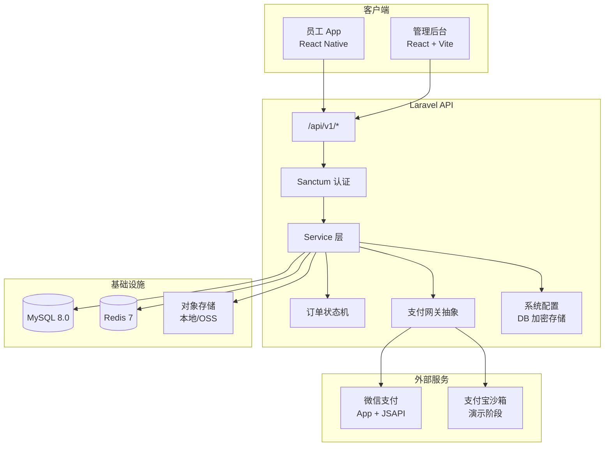
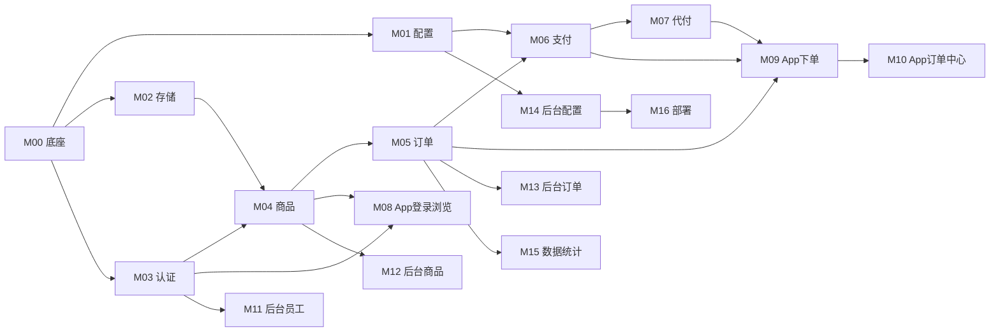

# 内部商城系统 — 总体设计 Spec

> **文档版本：** v1.0.0  
> **日期：** 2026-07-12  
> **项目代号：** 内购平台  
> **执行方式：** 按模块编号 **M00 → M16** 逐个完成，**不批量并行**

---

## 1. 项目概述

### 1.1 背景

为公司内部员工提供下午茶/晚餐预订能力，建设内部商城系统，作为数字化办公基础设施。

### 1.2 目标

| 端 | 目标 |
|---|---|
| 员工 App | 浏览商品、下单、微信支付、找人代付、订单管理、个人中心 |
| 管理后台 | 员工管理、商品管理、订单管理、系统配置、数据统计 |
| 技术底座 | 用户认证、支付对接、图片存储、订单状态机、配置与代码分离 |

### 1.3 非目标（本期不做）

- 对外开放注册（仅内部员工）
- 多商户 / 多门店
- 优惠券、积分、会员等级
- iOS 首发（先 Android，iOS 后续模块）
- 复杂物流 / 快递跟踪

### 1.4 与现有代码库对齐

```
king-shop/
├── backend/    # Laravel 12 API — 唯一数据源
├── frontend/   # React 管理后台
├── app/        # React Native 员工端
└── docker-compose.yml  # MySQL 8.0 + Redis 7（本地开发）
```

**已有：** 三端脚手架、健康检查 `GET /api/v1/health`、统一响应格式约定。  
**待建：** 全部业务模块（见第 3 节）。

---

## 2. 架构设计

### 2.1 系统架构



### 2.2 API 约定

| 项 | 规范 |
|---|---|
| 前缀 | `/api/v1/` |
| 成功响应 | `{ "code": 0, "message": "ok", "data": {} }` |
| 业务错误 | `{ "code": <非0>, "message": "...", "data": null }` |
| 鉴权 | `Authorization: Bearer <token>`（Laravel Sanctum） |
| 分页 | `?page=1&per_page=20`，响应 `data: { items: [], meta: { total, page, per_page } }` |

### 2.3 角色与权限

| 角色 | 标识 | 能力 |
|---|---|---|
| 员工 | `employee` | App 端全部功能 |
| 管理员 | `admin` | 后台全部功能 |
| 超级管理员 | `super_admin` | 后台 + 敏感配置修改 |

员工与管理员共用 `users` 表，通过 `role` 字段区分。管理员登录后台，员工登录 App。

### 2.4 配置管理方案（配置与代码分离）

敏感配置 **不入代码、不入 .env 业务段**，存 `system_configs` 表，值 AES 加密：

| 配置键 | 说明 | 示例 |
|---|---|---|
| `payment.provider` | 支付渠道 | `alipay_sandbox` / `wechat` |
| `payment.wechat.*` | 微信商户参数 | mch_id, api_key, cert |
| `payment.alipay.*` | 支付宝参数 | app_id, private_key |
| `storage.driver` | 存储驱动 | `local` / `oss` |
| `storage.oss.*` | OSS 参数 | bucket, endpoint, key |
| `app.name` | 商城名称 | 内部下午茶 |
| `order.auto_cancel_minutes` | 未支付自动取消 | `30` |

`.env` 仅保留：`APP_KEY`（用于加密）、数据库/Redis 连接、Laravel 框架级配置。

### 2.5 订单状态机

```
pending_payment → paid → preparing → ready → completed
       ↓              ↓
   cancelled      refunded（预留，本期可只实现取消未支付）
```

| 状态 | 含义 | 触发 |
|---|---|---|
| `pending_payment` | 待支付 | 创建订单 |
| `paid` | 已支付 | 支付回调 / 主动查询确认 |
| `preparing` | 备餐中 | 管理员操作 |
| `ready` | 可取餐 | 管理员操作 |
| `completed` | 已完成 | 员工确认取餐 / 管理员操作 |
| `cancelled` | 已取消 | 超时 / 用户取消 / 管理员取消 |

### 2.6 支付方案

**阶段一（演示）：** 支付宝沙箱 — 无需微信商户号，开发联调快。  
**阶段二（上线）：** 微信支付 — App 支付（员工自己付）+ JSAPI（找人代付，付款人微信内完成）。

支付网关抽象接口：

```php
interface PaymentGatewayInterface {
    public function createPayment(Order $order, array $options = []): PaymentResult;
    public function queryPayment(string $outTradeNo): PaymentStatus;
    public function handleNotify(Request $request): NotifyResult;
}
```

**找人代付流程：**

1. 下单员工创建订单，选择「找人代付」
2. 后端生成代付链接（含 JSAPI 预支付参数）
3. 员工分享链接给同事
4. 同事微信打开链接完成 JSAPI 支付
5. 回调更新订单 `paid_by_user_id`（实际付款人）

### 2.7 核心数据模型

```
users
├── id, name, phone, employee_no, department, role, status, avatar
└── timestamps

categories
├── id, name, sort, status
└── timestamps

products
├── id, category_id, name, description, price, image_url
├── stock, status (on_sale/off_sale), sort
└── timestamps

orders
├── id, order_no, user_id, total_amount, status
├── payment_method (self/proxy), paid_by_user_id, paid_at
├── remark, cancelled_at, cancel_reason
└── timestamps

order_items
├── id, order_id, product_id, product_name, product_image
├── price, quantity, subtotal
└── timestamps

payments
├── id, order_id, out_trade_no, trade_no, amount, channel
├── status (pending/success/failed), paid_at, raw_notify
└── timestamps

system_configs
├── id, group, key, value (encrypted), description
└── timestamps
```

---

## 3. 开发模块清单

> **执行规则：** 严格按编号顺序。每个模块有独立 **验收标准**，通过后再开始下一模块。  
> 对 Agent 说：`执行 M0X` 即开始该模块的实施计划。

### 模块依赖图



---

### M00 — 后端 API 底座

**范围：** 统一响应、异常处理、Sanctum 安装、基础中间件、目录规范。

**交付物：**
- `app/Http/Responses/ApiResponse.php`
- `app/Exceptions/Handler` 业务异常统一 JSON
- Sanctum 配置完成
- `app/Services/`、`app/Http/Requests/`、`app/Http/Resources/` 目录
- Feature Test：`GET /api/v1/health` 格式校验

**验收标准：**
- [ ] 所有 API 返回 `{ code, message, data }` 格式
- [ ] 422 验证错误格式统一
- [ ] `php artisan test` 通过

**预估：** 0.5 天

---

### M01 — 系统配置管理

**范围：** `system_configs` 表、加密读写 Service、后台读取 API。

**交付物：**
- Migration `system_configs`
- `SystemConfigService`（get/set/encrypt/decrypt）
- `GET/PUT /api/v1/admin/configs`（admin 鉴权）
- Seeder：默认配置项

**验收标准：**
- [ ] 配置写入后可读取，数据库中值为密文
- [ ] 不同 `APP_KEY` 无法解密（换 key 测一次）
- [ ] 管理员可查看/修改非敏感配置，敏感项脱敏展示（`****`）

**预估：** 0.5 天

---

### M02 — 图片存储

**范围：** 上传 API、本地存储驱动、OSS 驱动占位（配置切换）。

**交付物：**
- `POST /api/v1/admin/upload` 图片上传
- `StorageService` 支持 `local` / `oss` 切换（读 M01 配置）
- 图片大小/格式校验（jpg/png/webp，≤2MB）

**验收标准：**
- [ ] 上传返回可访问 URL
- [ ] `storage.driver=local` 时文件存 `storage/app/public`
- [ ] 切换配置后新上传走对应驱动（OSS 可 mock 测）

**预估：** 0.5 天

---

### M03 — 用户认证与员工模型

**范围：** users 表扩展、登录/登出、员工 CRUD（API 层，后台 UI 在 M11）。

**交付物：**
- Migration 扩展 `users`（phone, employee_no, department, role, status）
- `POST /api/v1/auth/login`（手机号 + 密码）
- `POST /api/v1/auth/logout`
- `GET /api/v1/auth/me`
- `POST/GET/PUT/DELETE /api/v1/admin/employees`
- 初始 seeder：超级管理员 `13800000000` / `admin123`

**验收标准：**
- [ ] 员工/管理员可登录获 token
- [ ] 非 admin 角色无法访问 `/admin/*`
- [ ] 手机号唯一、员工工号唯一

**预估：** 1 天

---

### M04 — 商品管理

**范围：** 分类 + 商品 CRUD、上下架、App 端商品列表/详情。

**交付物：**
- Migrations: `categories`, `products`
- Admin API: 分类/商品 CRUD
- App API: `GET /api/v1/categories`, `GET /api/v1/products`, `GET /api/v1/products/{id}`
- 库存扣减策略文档（下单时扣减，取消时回滚）

**验收标准：**
- [ ] 下架商品 App 不可见
- [ ] 商品列表支持分类筛选、分页
- [ ] 价格为分（整数）存储，避免浮点误差

**预估：** 1 天

---

### M05 — 订单系统

**范围：** 下单、订单查询、状态机、超时取消 Job。

**交付物：**
- Migrations: `orders`, `order_items`
- `OrderService` + `OrderStateMachine`
- App API:
  - `POST /api/v1/orders` 创建订单
  - `GET /api/v1/orders` 我的订单
  - `GET /api/v1/orders/{id}` 详情
  - `POST /api/v1/orders/{id}/cancel` 取消（仅 pending_payment）
- Admin API: 订单列表、详情、状态变更
- `CancelExpiredOrders` 定时任务（读 M01 超时配置）

**验收标准：**
- [ ] 下单扣减库存，取消回滚
- [ ] 订单号唯一（如 `KS202607121430001`）
- [ ] 超时未支付自动取消
- [ ] 状态流转非法转换返回业务错误

**预估：** 1.5 天

---

### M06 — 支付对接

> **Design Spec：** [2026-07-12-M06-payment-integration-design.md](./2026-07-12-M06-payment-integration-design.md)  
> **Implementation Plan：** [2026-07-12-M06-payment-integration.md](../plans/2026-07-12-M06-payment-integration.md)

**范围：** 支付网关抽象、支付宝沙箱实现、微信支付实现、回调 + 主动查询。

**交付物：**
- Migration: `payments`
- `PaymentGatewayInterface` + `AlipaySandboxGateway` + `WechatPayGateway`
- `POST /api/v1/orders/{id}/pay` 发起支付
- `POST /api/v1/payments/notify/alipay` 回调
- `POST /api/v1/payments/notify/wechat` 回调
- `QueryPendingPayments` 定时任务（应对回调失败）
- 支付配置从 M01 读取

**验收标准：**
- [ ] 支付宝沙箱：创建支付 → 回调 → 订单变 `paid`
- [ ] 回调验签通过
- [ ] 主动查询可补偿回调丢失
- [ ] 重复回调幂等（不重复更新）

**预估：** 2 天

---

### M07 — 找人代付

> **Design Spec：** [2026-07-12-M07-proxy-pay-design.md](./2026-07-12-M07-proxy-pay-design.md)  
> **Implementation Plan：** [2026-07-12-M07-proxy-pay.md](../plans/2026-07-12-M07-proxy-pay.md)  
> **执行记录：** [2026-07-12-M07-proxy-pay.md](../records/2026-07-12-M07-proxy-pay.md)

**范围：** 代付链接生成、JSAPI 支付、付款人记录。

**交付物：**
- 订单 `payment_method=proxy` 分支
- `POST /api/v1/orders/{id}/proxy-pay-link` 生成代付链接
- 代付落地页（轻量 H5 或 frontend 静态页）调 JSAPI
- 支付成功后记录 `paid_by_user_id`

**验收标准：**
- [ ] 下单人可不付款，分享链接
- [ ] 代付人微信内完成支付
- [ ] 订单详情展示「代付人」信息
- [ ] 链接有效期 = 订单支付超时时间

**预估：** 1.5 天

---

### M08 — App：登录与商品浏览

**范围：** RN 端登录页、首页商品列表、分类 Tab、商品详情页。

**交付物：**
- `app/src/api/` API 客户端封装
- `app/src/screens/LoginScreen`
- `app/src/screens/HomeScreen`（分类 + 商品列表）
- `app/src/screens/ProductDetailScreen`
- Token 持久化（AsyncStorage）

**验收标准：**
- [ ] 登录后浏览商品
- [ ] 商品图片正常加载
- [ ] 下拉刷新、空状态展示

**预估：** 1.5 天

---

### M09 — App：下单与支付

**范围：** 购物车（或直接购买）、确认订单、支付（支付宝沙箱 / 微信）、代付分享。

**交付物：**
- `app/src/screens/CartScreen`（或详情页直接购买）
- `app/src/screens/CheckoutScreen`
- `app/src/screens/PaymentScreen`
- 微信支付 SDK 集成（Android）
- 代付分享（系统分享 API）

**验收标准：**
- [ ] 完整走通：选品 → 下单 → 支付 → 订单变已支付
- [ ] 代付链接可分享
- [ ] 支付失败有明确提示

**预估：** 2 天

---

### M10 — App：订单管理与个人中心

**范围：** 订单列表/详情、取消订单、确认取餐、个人中心。

**交付物：**
- `app/src/screens/OrdersScreen`
- `app/src/screens/OrderDetailScreen`
- `app/src/screens/ProfileScreen`
- Tab 导航结构

**验收标准：**
- [ ] 订单按状态分组/筛选
- [ ] 待支付可取消
- [ ] 可取餐状态可确认完成
- [ ] 个人中心展示姓名、部门、手机号

**预估：** 1 天

---

### M11 — 管理后台：员工管理

**范围：** 员工列表、新增/编辑/禁用、角色分配。

**交付物：**
- `frontend/src/pages/employees/` 页面
- 登录页（管理员）
- 基础 Layout（侧边栏导航）
- 对接 M03 员工 API

**验收标准：**
- [ ] 管理员可 CRUD 员工
- [ ] 禁用员工无法登录 App
- [ ] 表格分页、搜索（姓名/手机号）

**预估：** 1 天

---

### M12 — 管理后台：商品管理

**范围：** 分类管理、商品 CRUD、图片上传、上下架。

**交付物：**
- `frontend/src/pages/categories/`
- `frontend/src/pages/products/`
- 图片上传组件（调 M02 API）

**验收标准：**
- [ ] 可管理分类排序
- [ ] 商品支持上传封面图
- [ ] 上下架即时生效

**预估：** 1.5 天

---

### M13 — 管理后台：订单管理

**范围：** 订单列表、详情、状态操作（备餐/可取餐/完成/取消）。

**交付物：**
- `frontend/src/pages/orders/`
- 订单状态操作按钮（按状态机控制显隐）
- 订单详情含商品明细、支付信息

**验收标准：**
- [ ] 可按状态/日期/员工筛选
- [ ] 状态变更符合状态机
- [ ] 代付订单展示付款人

**预估：** 1 天

---

### M14 — 管理后台：系统配置

**范围：** 可视化配置支付/存储/商城参数。

**交付物：**
- `frontend/src/pages/settings/`
- 分组表单：基础信息 / 支付配置 / 存储配置
- 敏感字段脱敏展示

**验收标准：**
- [ ] 修改支付渠道后新订单走新渠道
- [ ] 配置保存后加密存储
- [ ] 表单校验完整

**预估：** 1 天

---

### M15 — 数据统计

**范围：** 仪表盘：今日订单、销售额、热门商品、订单状态分布。

**交付物：**
- `GET /api/v1/admin/dashboard/stats`
- `frontend/src/pages/dashboard/`
- 简单图表（推荐 recharts）

**验收标准：**
- [ ] 展示今日/本周关键指标
- [ ] 热门商品 Top 5
- [ ] 数据与订单表一致（可用 seed 数据验证）

**预估：** 1 天

---

### M16 — 部署与交付

**范围：** 生产 Docker Compose、部署文档、环境检查脚本。

**交付物：**
- `deploy/docker-compose.prod.yml`（Nginx + PHP-FPM + MySQL + Redis）
- `docs/deploy-guide.md`（图文部署指引）
- `scripts/health-check.sh`
- 生产 `.env.example` 模板

**验收标准：**
- [ ] 一键 `docker compose up` 可启动
- [ ] 部署文档覆盖：域名备案、SSL、微信商户配置
- [ ] 健康检查脚本返回 0

**预估：** 1 天

---

## 4. 整体时间线

| 阶段 | 模块 | 累计预估 |
|---|---|---|
| 第 1 周 | M00–M03 底座 | 2.5 天 |
| 第 2 周 | M04–M07 核心业务 | 6 天 |
| 第 3 周 | M08–M10 App | 4.5 天 |
| 第 4 周 | M11–M15 后台 | 5.5 天 |
| 第 5 周 | M16 部署 + 联调 | 1 天 |
| **合计** | | **约 19.5 人天** |

> PDF 建议 5–8 天为 AI 并行开发估算；本 spec 按 **串行单模块** 估算，更符合「不批量处理」执行方式。

### 与甲方并行事项

| 事项 | 说明 | 建议启动时间 |
|---|---|---|
| 域名 + ICP 备案 | 10–20 工作日 | 立即 |
| 微信开放平台 | 注册 + 创建移动应用 | 立即 |
| 微信支付商户号 | 公司主体申请 | 第 1 周 |
| 微信公众号 | JSAPI 代付需要 | 第 1 周 |
| 云服务器 | 2核2G 国内 | 第 2 周 |
| OSS 资源包 | 40GB | 第 3 周 |
| 苹果开发者账号 | iOS 需要时 | 第 4 周 |

---

## 5. 技术决策记录

| 决策 | 选择 | 理由 |
|---|---|---|
| 金额存储 | 整数分（`unsignedBigInteger`） | 避免浮点精度问题 |
| 支付演示 | 先支付宝沙箱 | PDF 建议，无需等微信商户号 |
| 配置存储 | DB 加密，非 .env | PDF 要求配置代码分离 |
| 订单号 | `KS` + 日期时间 + 序号 | 可读、唯一 |
| 库存 | 下单扣减 | 内部商城并发量低，简单可靠 |
| 代付 | 微信 JSAPI | PDF 指定 |
| 图片 | 支持 local/OSS 切换 | 开发 local，生产 OSS |
| 定时任务 | Laravel Scheduler + Redis 队列 | 超时取消、支付查询 |

---

## 6. 交付物清单

| 类别 | 内容 |
|---|---|
| 源代码 | backend / frontend / app 三端完整源码 |
| 数据库 | Migrations + Seeders |
| 部署 | Docker Compose + 部署文档 + 操作录屏（可选） |
| 配置 | 后台可视化配置，甲方无需改代码即可上线 |
| 文档 | API 文档（各模块完成后补充） |

---

## 7. 执行指南

### 7.1 如何开始

每次只执行一个模块。对 Agent 说：

```
执行 M05
```

Agent 将：
1. 读取本 spec 对应模块范围
2. 按 `writing-plans` 技能生成该模块的详细实施计划（`docs/superpowers/plans/YYYY-MM-DD-M05-orders.md`）
3. 等你确认后再写代码
4. 完成后按 **`docs/superpowers/docker-testing.md`** 跑 Docker 测试并更新验收 checklist

### 7.2 模块状态跟踪

在下方表格更新状态（手动或让 Agent 更新）：

| 模块 | 名称 | 状态 | 完成日期 |
|---|---|---|---|
| M00 | 后端 API 底座 | ✅ 已完成 | 2026-07-12 |
| M01 | 系统配置管理 | ✅ 已完成 | 2026-07-12 |
| M02 | 图片存储 | ✅ 已完成 | 2026-07-12 |
| M03 | 用户认证与员工模型 | ⬜ 待开始 | |
| M04 | 商品管理 | ✅ 完成 | 2026-07-12 |
| M05 | 订单系统 | ✅ 已完成（App API + 超时取消；无库存扣减，见 M04） | 2026-07-12 |
| M06 | 支付对接 | ✅ 已完成 | 2026-07-12 · [spec](./2026-07-12-M06-payment-integration-design.md) |
| M07 | 找人代付 | ✅ 已完成 | 2026-07-12 · [spec](./2026-07-12-M07-proxy-pay-design.md) |
| M08 | App 登录与商品浏览 | ⬜ 待开始 | |
| M09 | App 下单与支付 | ⬜ 待开始 | |
| M10 | App 订单管理与个人中心 | ⬜ 待开始 | |
| M11 | 后台员工管理 | ⬜ 待开始 | |
| M12 | 后台商品管理 | ⬜ 待开始 | |
| M13 | 后台订单管理 | ✅ 已完成 | 2026-07-12 |
| M14 | 后台系统配置 | ✅ 已完成 | 2026-07-12 |
| M15 | 数据统计 | ⬜ 待开始 | |
| M16 | 部署与交付 | ⬜ 待开始 | |

状态图例：⬜ 待开始 · 🔄 进行中 · ✅ 已完成

### 7.3 建议首发路径

```
M00 → M01 → M02 → M03 → M04 → M05 → M06 → M11 → M12 → M13 → M08 → M09 → M10 → M07 → M14 → M15 → M16
```

说明：M06 完成后可先做后台（M11–M13）验证全链路，再做 App（M08–M10），代付（M07）依赖支付和 App 基础。

---

## 8. 风险与应对

| 风险 | 应对 | 关联模块 |
|---|---|---|
| 微信商户号未就绪 | 支付宝沙箱先行 | M06 |
| 支付回调失败 | 主动查询 Job | M06 |
| 备案周期长 | 开发期用海外服务器演示 | M16 |
| 配置泄露 | DB 加密 + 后台脱敏 | M01, M14 |

---

## 9. 待你确认的设计选择

以下按 PDF 与常见实践做了默认决策，如需调整请指出：

1. **登录方式：** 手机号 + 密码（内部员工，简单可靠）；后续可加企业微信 SSO。
2. **购物车：** 支持简单购物车；也允许详情页直接购买（1 件）。
3. **代付落地页：** 独立轻量 H5 页面（非完整 frontend），降低耦合。
4. **退款：** 本期仅实现「未支付取消」，已支付退款预留字段不实现流程。

---

**Spec 路径：** `docs/superpowers/specs/2026-07-12-internal-mall-design.md`

请审阅本 spec。确认后从 **M00** 开始，对我说 `执行 M00` 即可生成该模块的详细实施计划。
